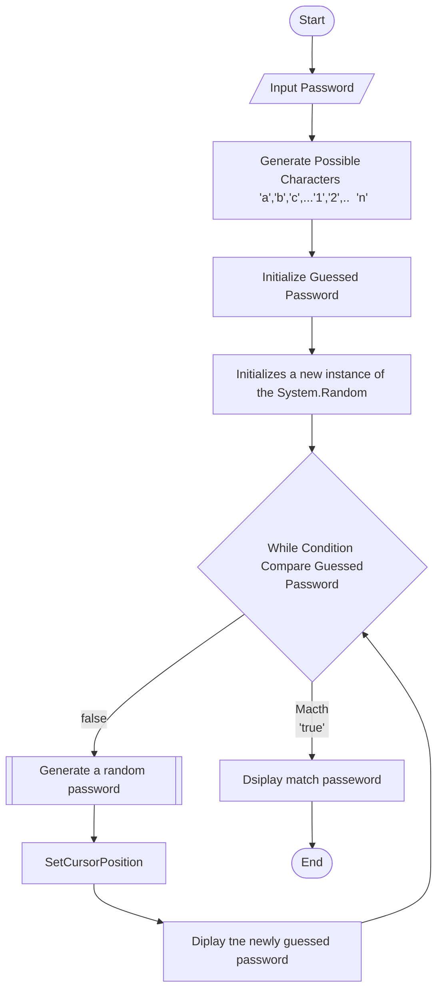

```mermaid
graph TD
A([Start]) --> B[/Input Password/]
B --> C[Generate Possible Characters <br/> 'a','b','c',...'1','2',..  'n']
C --> D[Initialize Guessed Password]
D --> E[Initializes a new instance of the System.Random]
E --> F{While Condition <br> Compare Guessed Password}
F --> |false| G[[Generate a random password]]
G --> H[SetCursorPosition]
H --> I[Diplay tne newly guessed password]
I --> F

F --> |Macth <br> 'true'| SubEnd[Dsiplay match passeword]
SubEnd --> End([End])
```
